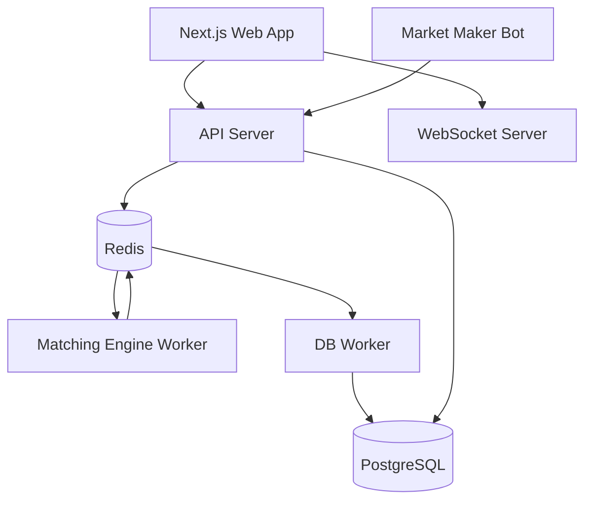

# Xchng

Xchng is a full-stack exchange platform built as a pnpm/Turbo monorepo. It includes a Next.js trading UI, an Express API gateway, an in-memory matching engine, Redis-backed service messaging, PostgreSQL persistence through Prisma, a WebSocket market-data service, and a configurable market maker.

## Tech Stack

| Layer | Technology |
| --- | --- |
| Web app | Next.js 15, React 19, Tailwind CSS, Better Auth |
| API | Express, Better Auth session validation, Redis RPC |
| Matching | TypeScript in-memory order books with Redis command queue |
| Realtime | `ws` WebSocket server with Redis pub/sub |
| Persistence | PostgreSQL, Prisma 7, async DB worker |
| Tooling | pnpm, Turbo, TypeScript, ESLint, Docker Compose |

## Monorepo Layout

```text
apps/
  api-server/   HTTP API for orders, balances, market data, and operator controls
  db-worker/    Persists engine events into PostgreSQL
  engine/       Matching engine worker and matching-domain tests
  mm-bot/       Liquidity bot that places and refreshes quote ladders
  web/          Next.js app for auth, markets, trade, wallet, and ops screens
  ws/           WebSocket service for live depth, trades, and ticker updates

packages/
  auth/         Better Auth server/client setup
  database/     Prisma schema, generated client, and shared DB instance
  env/          Typed environment loading
  eslint-config/
  types/        Shared TypeScript and Zod contracts
  typescript-config/
  ui/           Shared UI primitives and global styles
```

## Service Flow



1. The web app authenticates users with Better Auth and calls the API.
2. The API validates user sessions or internal service tokens, then submits engine commands through Redis.
3. The engine processes deposits, order placement, and cancellation, then publishes market and balance events.
4. The WebSocket service broadcasts live market events to subscribed clients.
5. The DB worker persists trades, ticker snapshots, order updates, and balances.
6. The market maker uses the API to maintain configurable bid/ask liquidity.

## Prerequisites

- Node.js 20 or newer
- pnpm 10.33.2
- Docker and Docker Compose

Enable pnpm through Corepack if needed:

```bash
corepack enable
corepack prepare pnpm@10.33.2 --activate
```

## Environment Setup

Create a local environment file:

```bash
cp .env.example .env
```

Required variables:

| Variable | Purpose |
| --- | --- |
| `DATABASE_URL` | PostgreSQL connection string |
| `REDIS_URL` | Redis connection string |
| `BETTER_AUTH_SECRET` | Better Auth secret, at least 32 characters |
| `BETTER_AUTH_URL` | Public auth origin, usually the web app URL |
| `INTERNAL_SECRET` | 32+ character bearer token for internal services such as the market maker |
| `NEXT_PUBLIC_APP_URL` | Browser-facing web app URL |
| `NEXT_PUBLIC_API_URL` | Browser/server API base URL, including `/api/v1` |
| `NEXT_PUBLIC_WS_URL` | Browser WebSocket URL |
| `OPERATOR_EMAILS` | Comma-separated emails allowed to access operator pages |

Optional market-maker variables:

| Variable | Default | Purpose |
| --- | --- | --- |
| `MM_MARKETS` | `TATA_INR` | Comma-separated markets to quote |
| `MM_LOOP_INTERVAL_MS` | `8000` | Refresh interval for each market loop |
| `MM_LEVELS` | `3` | Number of bid/ask levels per side |
| `MM_BASE_PRICE` | `100` | Initial reference price where no ticker exists |
| `MM_BASE_QUANTITY` | `2` | Base order size per quote level |
| `MM_SPREAD_BPS` | `50` | First-level spread in basis points |
| `MM_LEVEL_SPACING_BPS` | `25` | Additional spacing between quote levels |
| `MM_REPRICE_TOLERANCE_BPS` | `15` | Reprice tolerance setting for bot tuning |
| `MM_JITTER_BPS` | `8` | Quote jitter setting for bot tuning |
| `MM_TARGET_BASE_RATIO` | `0.5` | Target base inventory ratio |
| `MM_MAX_INVENTORY_SKEW_BPS` | `40` | Maximum inventory skew setting |

## Install

```bash
pnpm install
```

## Local Development

Start PostgreSQL and Redis, then sync the Prisma schema:

```bash
pnpm dev:start
```

Run all applications and services:

```bash
pnpm dev
```

Default local URLs:

| Service | URL |
| --- | --- |
| Web app | `http://localhost:3000` |
| API | `http://localhost:4000/api/v1` |
| WebSocket | `ws://localhost:4001` |
| PostgreSQL | `localhost:5432` |
| Redis | `localhost:6379` |

Stop local infrastructure and watched processes:

```bash
pnpm dev:stop
```

## Common Commands

| Command | Description |
| --- | --- |
| `pnpm dev` | Run all apps/services in watch mode |
| `pnpm dev:infra` | Start PostgreSQL and Redis with Docker Compose |
| `pnpm dev:db` | Generate Prisma client and push the schema |
| `pnpm build` | Build all workspaces |
| `pnpm start` | Start built production services |
| `pnpm lint` | Run configured ESLint tasks |
| `pnpm check-types` | Run TypeScript checks across workspaces |
| `pnpm --filter engine test` | Run matching-engine tests |
| `pnpm --filter @workspace/database db:generate` | Generate the Prisma client |
| `pnpm --filter @workspace/database db:deploy` | Apply Prisma migrations in production |
| `pnpm --filter @workspace/database db:studio` | Open Prisma Studio |

## API Surface

Base URL: `NEXT_PUBLIC_API_URL` or `http://localhost:4000/api/v1`.

| Method | Path | Description | Auth |
| --- | --- | --- | --- |
| `POST` | `/order` | Place an order | Session or internal token |
| `DELETE` | `/order` | Cancel an order | Session or internal token |
| `GET` | `/order/open` | List open orders for a user and market | Session or internal token |
| `GET` | `/order/history` | List historical orders | Session or internal token |
| `GET` | `/depth?symbol=MARKET` | Get current order-book depth | Public |
| `GET` | `/trades?symbol=MARKET` | Get recent trades | Public |
| `GET` | `/ticker?symbol=MARKET` | Get latest ticker for one market | Public |
| `GET` | `/tickers` | Get latest tickers for all markets | Public |
| `GET` | `/balances?userId=USER_ID` | Get user balances | Session or internal token |
| `POST` | `/deposit` | Credit a user balance | Session or internal token |
| `GET` | `/mm-bot/statuses` | Get market-maker health/status | Public |
| `POST` | `/mm-bot/paused` | Pause or resume a market-maker bot | Session or internal token |

Internal services authenticate with:

```http
Authorization: Bearer <INTERNAL_SECRET>
```

## WebSocket Channels

Connect to `NEXT_PUBLIC_WS_URL` and subscribe with:

```json
{ "method": "SUBSCRIBE", "params": ["depth@TATA_INR", "trade@TATA_INR", "ticker@TATA_INR"] }
```

Supported channel patterns:

| Channel | Payload |
| --- | --- |
| `depth@MARKET` | Order-book depth updates |
| `trade@MARKET` | Trade execution updates |
| `ticker@MARKET` | Ticker updates |

Unsubscribe with:

```json
{ "method": "UNSUBSCRIBE", "params": ["depth@TATA_INR"] }
```

## Database

The Prisma schema is in `packages/database/prisma/schema.prisma`.

Development uses `db:push` for fast schema sync:

```bash
pnpm dev:db
```

Production should use migrations:

```bash
pnpm --filter @workspace/database db:deploy
```

Generated Prisma output lives under `packages/database/generated` and is intentionally ignored by git.

## Production Checklist

1. Set strong production values for `BETTER_AUTH_SECRET` and `INTERNAL_SECRET`.
2. Point `DATABASE_URL`, `REDIS_URL`, `BETTER_AUTH_URL`, `NEXT_PUBLIC_APP_URL`, `NEXT_PUBLIC_API_URL`, and `NEXT_PUBLIC_WS_URL` at production infrastructure.
3. Run `pnpm install --frozen-lockfile`.
4. Generate Prisma client and apply migrations with `pnpm --filter @workspace/database db:generate` and `pnpm --filter @workspace/database db:deploy`.
5. Run `pnpm check-types`, `pnpm lint`, and `pnpm --filter engine test`.
6. Build with `pnpm build`.
7. Start the required services with `pnpm start` or your process manager.

At minimum, production needs these long-running processes:

| Workspace | Process |
| --- | --- |
| `web` | Next.js web server |
| `api-server` | Express API |
| `engine` | Matching engine worker |
| `ws` | WebSocket market-data server |
| `db-worker` | Persistence worker |
| `mm-bot` | Optional liquidity bot |

## Repository Hygiene

The repository intentionally excludes generated output and local caches such as `node_modules`, `.next`, `.turbo`, `dist`, `coverage`, logs, and `packages/database/generated`. Recreate generated assets with the documented install, build, and Prisma commands instead of committing them.
