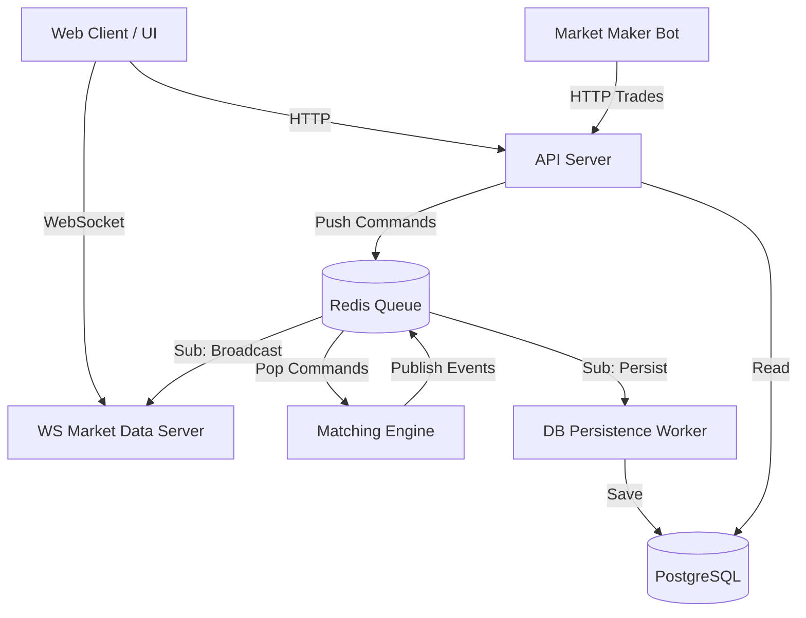

# Xchng 🚀

 <!-- Replace with a real screenshot of the application -->

**Xchng** is a full-stack, highly scalable, and high-performance cryptocurrency exchange platform. Built from the ground up as a sophisticated **microservices-based monorepo**, it aims to replicate the core infrastructure and UI/UX of leading centralized exchanges (like Binance or Coinbase).

This project is designed to demonstrate proficiency in system architecture, real-time data processing, modern frontend development, and distributed systems.

---

## 🌟 Key Features

- **Blazing Fast In-Memory Matching Engine**: Processes Limit and Market orders in real-time, executing trades with microsecond precision.
- **Event-Driven Architecture**: Uses **Redis Pub/Sub** to decouple the matching engine from the rest of the application, ensuring high throughput and horizontal scalability.
- **Real-time WebSocket Streaming**: Live order book (depth), recent trades, and ticker updates streamed instantly to the frontend.
- **Modern, Premium UI/UX**: Built with Next.js 15, React 19, and Tailwind CSS. Features dark mode, glassmorphism, and seamless TradingView charts integration.
- **Automated Market Maker (MM) Bot**: A built-in liquidity bot that actively quotes bid/ask spreads, ensuring the exchange always has deep liquidity and realistic price action.
- **Asynchronous Database Persistence**: The `db-worker` asynchronously flushes trades and balances to **PostgreSQL** without blocking the main matching loop.
- **Secure Authentication**: Utilizing `better-auth` for robust session validation and OAuth integration.

---

## 🏗 System Architecture

Xchng uses a **pnpm / Turbo** monorepo structure, separating concerns into discrete, scalable microservices.



### 📦 Microservices Breakdown (Apps)
- `apps/engine`: The heart of the exchange. An in-memory matching engine that processes order books.
- `apps/api-server`: Express HTTP Gateway for order placement, fetching balances, and authentication.
- `apps/ws`: WebSocket server broadcasting live market events to subscribed clients.
- `apps/db-worker`: Background worker that reliably persists matching engine events (trades, balance updates) into PostgreSQL.
- `apps/mm-bot`: Autonomous liquidity bot that places and refreshes quote ladders based on current market prices.
- `apps/web`: The Next.js frontend application featuring the Trading interface, Wallet, and Authentication.

---

## 💻 Tech Stack

- **Frontend**: Next.js 15 (App Router), React 19, Tailwind CSS, TypeScript, TradingView Lightweight Charts.
- **Backend**: Node.js, Express, TypeScript.
- **State & Messaging**: Redis (Queue & Pub/Sub).
- **Database**: PostgreSQL with Prisma ORM.
- **Tooling/DevOps**: pnpm, Turborepo, Docker, Docker Compose, ESLint.

---

## 🚀 How to Run Locally

### Prerequisites
- Node.js 20+
- pnpm 10.x (`corepack enable && corepack prepare pnpm@10.33.2 --activate`)
- Docker & Docker Compose

### Step 1: Clone & Install
```bash
git clone https://github.com/your-username/Xchng.git
cd Xchng
pnpm install
```

### Step 2: Environment Variables
Create a local `.env` file based on the example:
```bash
cp .env.example .env
```

### Step 3: Start Infrastructure (Redis + Postgres) & Migrate
```bash
pnpm dev:infra
pnpm dev:db
```

### Step 4: Run the Exchange
Run all microservices and the web app concurrently using Turbo:
```bash
pnpm dev
```
- **Web UI:** http://localhost:3000
- **API Server:** http://localhost:4000/api/v1
- **WebSocket:** ws://localhost:4001

To stop all services and tear down Docker containers:
```bash
pnpm dev:stop
```

---

## 🌍 Free Deployment Guide (Production)

Deploying a complex microservices architecture usually costs money, but here is the ultimate guide to hosting Xchng for **free**:

### 1. Frontend (Web App)
- Deploy `apps/web` to **Vercel** (100% Free). Vercel natively supports Turbo monorepos.

### 2. Database & Cache
- **PostgreSQL**: Spin up a free serverless database on **Neon.tech** or **Supabase**.
- **Redis**: Spin up a free serverless Redis cluster on **Upstash**.

### 3. Backend Microservices
Because Xchng relies on 5 background node services (`engine`, `ws`, `db-worker`, `api-server`, `mm-bot`), PaaS providers like Render or Heroku will limit you.
- **The "Cheat Code"**: Use **Oracle Cloud Always Free Tier**. Oracle gives you a powerful ARM VPS (up to 4 Cores, 24GB RAM) completely free forever.
- Clone the repository onto your Oracle VPS.
- Provide the Neon Postgres URL and Upstash Redis URL in your `.env`.
- Use the included `Dockerfile` to build the app, and run it using Docker Compose, or run all services natively via `pnpm start`.

```bash
# Production Build & Start
pnpm install --frozen-lockfile
pnpm build
pnpm start
```

---

## 📡 API Documentation

Base URL: `http://localhost:4000/api/v1`

| Method | Path | Description | Auth |
| --- | --- | --- | --- |
| `POST` | `/order` | Place a Limit or Market order | Session |
| `DELETE` | `/order` | Cancel an open order | Session |
| `GET` | `/order/open` | List open orders | Session |
| `GET` | `/depth?symbol=MARKET`| Get current order-book depth | Public |
| `GET` | `/trades?symbol=MARKET`| Get recent trades | Public |
| `GET` | `/ticker?symbol=MARKET`| Get latest ticker for a market | Public |
| `GET` | `/balances` | Get user wallet balances | Session |
| `POST` | `/deposit` | Deposit mock funds | Session |

---

## 🧑‍💻 Author & Acknowledgements

Built to showcase modern full-stack engineering and systems design. If you're a technical recruiter or hiring manager looking for engineers who can architect distributed systems, feel free to dive into the `apps/engine` and `apps/ws` directories!
