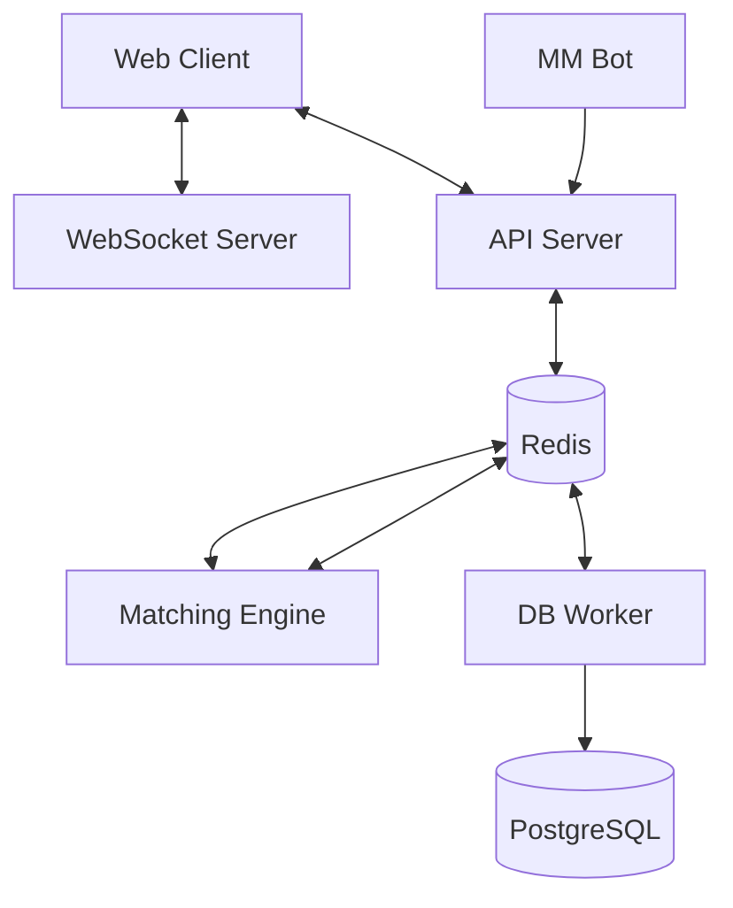

# Xchng - High Performance Crypto Exchange

Xchng is a distributed cryptocurrency exchange platform built as a high-performance monorepo. It leverages a modern stack to handle order matching, real-time data streaming, and persistent storage with high reliability.

## 🚀 Features

- **High-Performance Matching Engine**: In-memory order matching with Redis-based command queuing.
- **Real-Time Data Streaming**: Standalone WebSocket server for live orderbook, trade, and ticker updates.
- **Distributed Architecture**: Decoupled services for matching, API, DB persistence, and frontend.
- **Automated Market Making**: Built-in MM bot to provide liquidity and realistic trading volume.
- **Modern Tech Stack**: Next.js 15, Turbo, Prisma, Redis, PostgreSQL, and Tailwind CSS.
- **Secure Authentication**: Integrated with Better Auth for robust user management.

## 🏗️ Project Structure

- `apps/web`: Modern Next.js frontend with a premium dark-themed trading interface.
- `apps/engine`: The core matching engine that processes limit and market orders.
- `apps/api-server`: RESTful API gateway for order placement and data retrieval.
- `apps/ws`: WebSocket service for low-latency market data broadcasting.
- `apps/db-worker`: Dedicated worker for asynchronous database persistence of trades and orders.
- `apps/mm-bot`: Automated market maker bot for liquidity provisioning.
- `packages/database`: Shared database access layer using Prisma and PostgreSQL.
- `packages/ui`: Shared UI component library.

## 🛠️ Getting Started

### 1. Prerequisites

- [Node.js](https://nodejs.org/) (v20+)
- [pnpm](https://pnpm.io/)
- [Docker](https://www.docker.com/)

### 2. Environment Setup

Copy the example environment file:

```bash
cp .env.example .env
```

### 3. Start Infrastructure & Database

Initialize the Redis and PostgreSQL containers, and push the Prisma schema:

```bash
pnpm dev:start
```

### 4. Run Development Environment

Start all microservices and the web application:

```bash
pnpm dev
```

The application will be available at `http://localhost:3000`.

## 🧪 Development Commands

| Command | Action |
| --- | --- |
| `pnpm dev:start` | Starts infrastructure (Docker) and syncs database schema |
| `pnpm dev` | Starts all services in development mode with hot-reloading |
| `pnpm build` | Builds all packages and applications for production |
| `pnpm lint` | Runs ESLint across the monorepo |
| `pnpm check-types` | Executes TypeScript type checks |
| `pnpm dev:stop` | Safely stops all containers and development processes |

## 📐 Architecture Diagram


